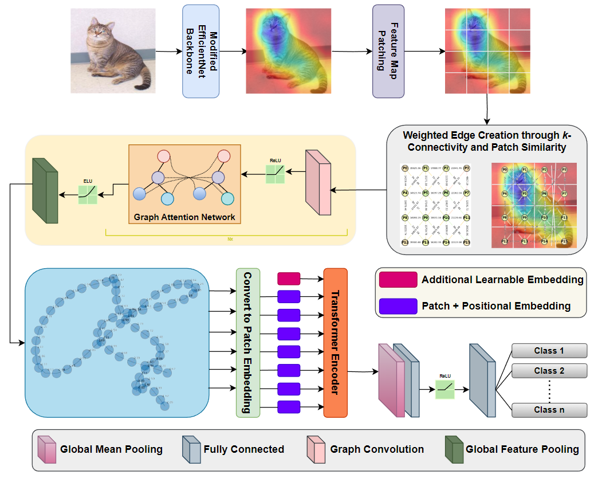

# SAG-ViT: A Scale-Aware, High-Fidelity Patching Approach with Graph Attention for Vision Transformers

[](https://arxiv.org/abs/2411.09420)

## Authors
**Shravan Venkatraman, Jaskaran Singh Walia, Joe Dhanith P R**

## Introduction

SAG-ViT is a novel framework designed to enhance Vision Transformers (ViT) with scale-awareness and refined patch-level feature embeddings. Traditional ViTs rely on fixed-sized patches extracted directly from images, often missing the multiscale hierarchies naturally captured by CNNs. Our method integrates:

- **CNN-derived multiscale feature extraction**: High-fidelity patches are obtained from CNN feature maps rather than raw pixels.
- **Graph-based patch organization**: Patches are modeled as nodes in a graph, capturing local spatial structures through k-connectivity and feature similarity.
- **Graph Attention Network (GAT)**: A GAT refines patch embeddings, leveraging attention to emphasize important local relationships.
- **Transformer Encoder**: Finally, a Transformer encoder integrates these refined embeddings globally, capturing long-range dependencies.

SAG-ViT consistently outperforms state-of-the-art approaches on diverse benchmark datasets, showcasing enhanced robustness and generalization.

## Architecture

The diagram below illustrates our SAG-ViT pipeline, from CNN feature extraction and patching to graph construction, GAT processing, and Transformer-based global reasoning:

<p align="center">
    
</p>

## Code Structure and Usage

This repository provides a modular and extensible codebase for training and evaluating SAG-ViT. The code is split into multiple files for clarity:

- **`data_loader.py`**:  
  Handles data loading and preprocessing.  
  - Defines transforms for input images.
  - Creates train/validation dataloaders using `ImageFolder` and random splits.
  - Set `data_dir = "path/to/data/dir"` to point to your dataset location.
  
- **`graph_construction.py`**:  
  Functions for extracting patches from CNN feature maps and constructing graphs.  
  - `extract_patches()`: Extracts multiscale, high-fidelity patches from CNN outputs.
  - `build_graph_from_patches()`: Builds spatially connected graphs from these patches.
  - `build_graph_data_from_patches()`: Converts NetworkX graphs to PyTorch Geometric data objects.

- **`model_components.py`**:  
  Core building blocks of SAG-ViT.  
  - `InceptionV3FeatureExtractor`: CNN backbone that produces rich feature maps.
  - `GATGNN`: Applies Graph Attention Network layers to refine patch embeddings.
  - `TransformerEncoder`: A Transformer-based encoder to capture long-range relationships.
  - `MLPBlock`: Final classification head mapping embeddings to output logits.

- **`sag_vit_model.py`**:  
  Integrates all components into the SAG-ViT model.  
  - Combines feature extraction (CNN), graph construction, GAT processing, Transformer encoding, and classification.

- **`train.py`**:  
  Handles training, validation, and early stopping.  
  - Defines `train_model()` for the training loop, metric computation (accuracy, F1, MCC, etc.), and early stopping.
  - Saves best model checkpoints and logs training history.

**Additional Files**:
- `requirements.txt`: Lists dependencies.
- `history.csv` (if generated): Records training/validation metrics over epochs.

## Getting Started

### Prerequisites
- Python >= 3.7
- PyTorch >= 1.7.0
- TorchVision
- Torch Geometric
- scikit-learn
- tqdm, pandas, matplotlib, seaborn, networkx

Install dependencies (if you have `requirements.txt`):
```bash
pip install -r requirements.txt
```

**Data Setup**:
- Organize your data in the format expected by `ImageFolder` (each class in its own folder).
- Update the `data_loader.py` with your dataset path: `data_dir = "path/to/data/dir"`.

**Running Training**:
```bash
python train.py
```
This will load data using `data_loader.py`, initialize the SAG-ViT model (`SAGViTClassifier`), and train and validate the model, saving the best checkpoint and training history. You can adjust hyperparameters (e.g., learning rate, epochs) directly in `train.py`.

**Results**  
We evaluated SAG-ViT on diverse datasets:
- **CIFAR-10** (natural images)
- **GTSRB** (traffic sign recognition)
- **NCT-CRC-HE-100K** (histopathological images)
- **NWPU-RESISC45** (remote sensing imagery)
- **PlantVillage** (agricultural imagery)

SAG-ViT achieves state-of-the-art results across all benchmarks, as shown in the table below (F1 scores):

<center>

| Backbone           | CIFAR-10 | GTSRB  | NCT-CRC-HE-100K | NWPU-RESISC45 | PlantVillage |
|--------------------|----------|--------|-----------------|---------------|--------------|
| DenseNet201        | 0.5427   | 0.9862 | 0.9214          | 0.4493        | 0.8725       |
| Vgg16              | 0.5345   | 0.8180 | 0.8234          | 0.4114        | 0.7064       |
| Vgg19              | 0.5307   | 0.7551 | 0.8178          | 0.3844        | 0.6811       |
| DenseNet121        | 0.5290   | 0.9813 | 0.9247          | 0.4381        | 0.8321       |
| AlexNet            | 0.6126   | 0.9059 | 0.8743          | 0.4397        | 0.7684       |
| Inception          | 0.7734   | 0.8934 | 0.8707          | 0.8707        | 0.8216       |
| ResNet             | 0.9172   | 0.9134 | 0.9478          | 0.9103        | 0.8905       |
| MobileNet          | 0.9169   | 0.3006 | 0.4965          | 0.1667        | 0.2213       |
| ViT - S            | 0.8465   | 0.8542 | 0.8234          | 0.6116        | 0.8654       |
| ViT - L            | 0.8637   | 0.8613 | 0.8345          | 0.8358        | 0.8842       |
| MNASNet1_0         | 0.1032   | 0.0024 | 0.0212          | 0.0011        | 0.0049       |
| ShuffleNet_V2_x1_0 | 0.3523   | 0.4244 | 0.4598          | 0.1808        | 0.3190       |
| SqueezeNet1_0      | 0.4328   | 0.8392 | 0.7843          | 0.3913        | 0.6638       |
| GoogLeNet          | 0.4954   | 0.9455 | 0.8631          | 0.3720        | 0.7726       |
| **Proposed (SAG-ViT)** | **0.9574** | **0.9958** | **0.9861** | **0.9549** | **0.9772** |

</center>

## Citation

If you find this work useful, please cite our paper:
```
@misc{venkatraman2024sagvitscaleawarehighfidelitypatching,
      title={SAG-ViT: A Scale-Aware, High-Fidelity Patching Approach with Graph Attention for Vision Transformers}, 
      author={Shravan Venkatraman and Jaskaran Singh Walia and Joe Dhanith P R},
      year={2024},
      eprint={2411.09420},
      archivePrefix={arXiv},
      primaryClass={cs.CV},
      url={https://arxiv.org/abs/2411.09420}, 
}
```
